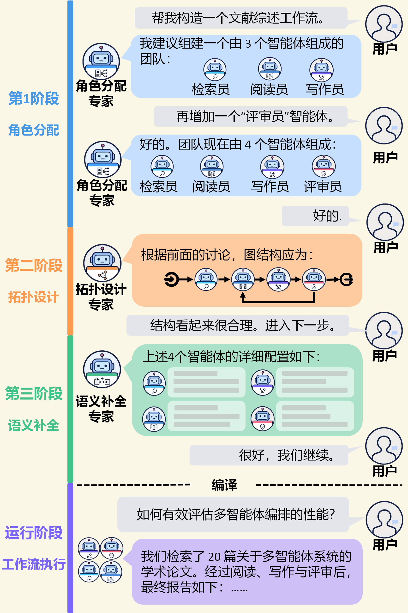
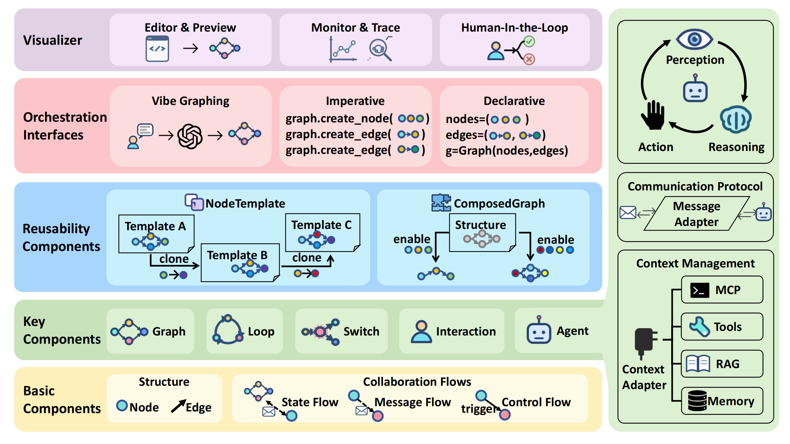

<div align="center">
  
  
</div>
<p align="center">
    【<a href="README.md">English</a>   | Chinese】
</p>

## 📖 概述

**MASFactory** 是一个以图结构为核心的 Multi‑Agent Orchestration 框架，面向 **Vibe Graphing** 场景打造：从意图出发生成图结构设计，在可视化环境中预览与编辑迭代收敛，最终编译为可运行的工作流，并在运行时追踪节点状态、消息与共享状态变化。

在线文档：https://bupt-gamma.github.io/MASFactory/

核心能力：

- **Vibe Graphing（intent → graph）：** 从自然语言意图形成结构设计，并迭代收敛到可执行、可复用的工作流。
- **Graph 积木式搭建：** 以 `Node/Edge` 显式描述流程与字段契约，支持子图、循环、分支与复合组件。
- **可视化与可观测：** 配套 **MASFactory Visualizer** 提供拓扑预览、运行追踪与人机交互能力。
- **上下文协议（ContextBlock）：** 以结构化方式组织 Memory / RAG / MCP 等上下文源，支持自动注入与按需检索。

## 🧭 为什么选择 MASFactory

随着多智能体能力快速增强，系统编排却仍停留在手工编排的时代：要么手写工作流代码，要么在画布里逐个节点拖拽配置。MASFactory 希望通过 Vibe Graphing, 把人类从繁复的编排工作中解放出来：先用自然语言表达意图，让 AI 起草协作结构，再由人持续纠正和确认，最后把结果编译成可执行图工作流。

<p align="center">
  
</p>

这样一来，人类的开发重点就从低层连线和重复配置，转移到了多智能体的设计本身。

如果用更直观的方式来看今天的多智能体开发工具，大致可以分成下面几类：

| 平台类型                   | 代表产品                                           | 定位                                     | 对多智能体的支持                                             |
| -------------------------- | -------------------------------------------------- | ---------------------------------------- | ------------------------------------------------------------ |
| **代码框架**               | `MASFactory`、ChatDev2(DevAll)、LangGraph、AutoGen | 构建复杂多智能体系统                     | 高度依赖手写代码与工程实现                                   |
| **低代码工作流平台**       | `MASFactory`、ChatDev2(DevAll)、Coze、Dify         | 低门槛低代码开发多智能体系统             | 难以支撑复杂多智能体系统的深度定制与复杂拓扑                 |
| **Vibe Graphing 编排框架** | `MASFactory`                                       | 低人力成本实现多智能体系统快速设计和迭代 | 人类无需付出过多的开发、拖拽的操作，只需要将自己的需求描述清楚，并在对话中细化设计细节。 |

## 🏗️ 系统框架图
MASFactory采用业界常用的以Graph为中心的多智能体编排方法，将系统抽象为4层：
<p align="center">
  
</p>
- **图骨架层**：以 `Node` 和 `Edge` 作为最底层抽象，用图结构表达多智能体之间的协作关系、依赖关系和消息流动
- **组件层**：组件层的作用，是把底层的 `Node`、`Edge` 进一步封装成可复用的协作单元，让开发者不必每次都从最底层手工拼装工作流，而是可以像搭积木一样组织多智能体系统：

> - `Agent` 是最基础的执行单元，对应一个具备角色、指令、工具、Memory、RAG 等能力的智能体节点，负责完成具体分析、生成、调用等任务。
>
> - `Graph` 用于把多个节点封装成可嵌套的子图，让复杂流程可以分层设计、局部复用，也让“一个阶段”本身还能继续作为“另一个更大图里的节点”。
>
> - `Loop` 用于处理多轮迭代型任务，例如反复讨论、持续修订、测试直到通过等场景，本质上把“重复执行直到满足条件”为止的控制逻辑做成了标准组件。
>
> - `Switch` 用于做分支判断和动态路由，可以按照显式条件切换执行路径，也可以结合模型能力决定消息应该流向哪个节点，从而支持更灵活的协作拓扑。
>
> - `Human` 则把人工确认、对话输入、文件审阅与编辑等 Human-in-the-loop 环节纳入图中，使多智能体系统不再是纯自动流程，而是能够在关键步骤引入人类参与。
>
> - `ComposedGraph`和`NodeTemplate` 是MASFactory 在上述组件的基础之上进一步提供了两套复用能力组件，前者负责“先声明模板、后实例化装配”，后者负责把常见协作结构直接封装成可复用组件。MASFactory内置了常用的图结构(`InstructorAssistantGraph`、`BrainstormingGraph`等)，方便用户开箱即用。

  **协议层**：通过 `Message Adapter` 与 `Context Adapter`，统一处理通信协议以及 Memory、RAG、MCP 等上下文能力，方便用户接入相关框架增强自己的多智能体系统。

- **交互层**：MASFactory同时提供三类开发范式：

 > - 基于`Vibe Graphing`的自然语言交互构造智能体工作流，降低系统开发的人力开支。
 > - 基于`声明式`、`命令式`的两种代码开发方式，可以更加灵活自由地编写工作流。
 > - 通过 `MASFactory Visualizer`以拖拽的方式手动设计工作流，兼容大家的低代码开发习惯。 

MASFactory 的优势并不在于“再提供一种工作流搭建方式”，而在于它把代码开发、可视化编辑和自然语言驱动编排统一进了同一套系统。开发者既可以自己写，也可以自己拖拽，还可以先让 AI 起草系统结构，再编译成可运行的多智能体工作流——以上三中方式并不是相互割裂独立的，而是可以在同一个项目中同时使用。

## 🎬 三种开发方式自由组合，并提供统一的运行时追踪

无论你先写代码、先拖拽，还是先做 Vibe Graphing，对应的图结构都能进入同一个 Visualizer 里做预览、追踪和人工介入。

### 代码编写与图结构实时预览

<p align="center">
  
</p>

### 拖拽式设计

<p align="center">
  
</p>

### Vibe Graphing 交互

<p align="center">
  
</p>

### 运行时监测

<p align="center">
  
</p>


## ⚡ 快速开始

### 1) 安装 MASFactory（PyPI）

环境要求：Python `>= 3.10`

```bash
pip install -U masfactory
```

验证安装：

```bash
python -c "from importlib.metadata import version; print('masfactory version:', version('masfactory'))"
python -c "from masfactory import RootGraph, Graph, Loop, Agent, CustomNode; print('import ok')"
```

### 2) 安装 MASFactory Visualizer（VS Code 插件）

MASFactory Visualizer 用于图结构预览、运行追踪与人机交互。

从 VS Code 插件市场安装：

1. 打开 VS Code → Extensions（扩展）
2. 搜索：`MASFactory Visualizer`
3. 安装并 Reload

打开方式：
- 活动栏（左侧）→ **MASFactory Visualizer** → **Graph Preview**，或
- 命令面板：
  - `MASFactory Visualizer: Start Graph Preview`
  - `MASFactory Visualizer: Open Graph in Editor Tab`

## 🧩 简单示例（来自「第一行代码」）

最小两阶段 Agent 工作流：**ENTRY → analyze → answer → EXIT**。

```python
import os
from masfactory import RootGraph, Agent, OpenAIModel, NodeTemplate

model = OpenAIModel(
    api_key=os.getenv("OPENAI_API_KEY", ""),
    base_url=os.getenv("OPENAI_BASE_URL") or os.getenv("BASE_URL") or None,
    model_name=os.getenv("OPENAI_MODEL_NAME", "gpt-4o-mini"),
)

BaseAgent = NodeTemplate(Agent, model=model)

g = RootGraph(
    name="qa_two_stage",
    nodes=[
        ("analyze", BaseAgent(instructions="你是问题分析专家。", prompt_template="用户问题：{query}")),
        ("answer", BaseAgent(instructions="你是解决方案专家，基于分析给出最终回答。", prompt_template="问题：{query}\n分析：{analysis}")),
    ],
    edges=[
        ("entry", "analyze", {"query": "用户问题"}),
        ("analyze", "answer", {"query": "原始问题", "analysis": "分析结果"}),
        ("answer", "exit", {"answer": "最终回答"}),
    ],
)

g.build()
out, _attrs = g.invoke({"query": "我想学习 Python，但不知道从哪里开始"})
print(out["answer"])
```

## ▶️ 运行仓库内的多智能体复现（applications/）

多数工作流需要 `OPENAI_API_KEY`；部分脚本也会读取 `OPENAI_BASE_URL` / `BASE_URL` 与 `OPENAI_MODEL_NAME`。

```bash
# ChatDev
python -m applications.chatdev.workflow.main --task "Develop a basic Gomoku game." --name "Gomoku"

# ChatDev Lite（简化版）
python -m applications.chatdev_lite.workflow.main --task "Develop a basic Gomoku game." --name "Gomoku"

# ChatDev Lite（VibeGraphing 版本）
python -m applications.chatdev_lite_vibegraph.main --task "Write a Ping-Pong (Pong) game." --name "PingPong"

# VibeGraph Demo（intent → graph_design.json → compile → run）
python -m applications.vibegraph_demo.main

# AgentVerse · PythonCalculator
python applications/agentverse/tasksolving/pythoncalculator/run.py --task "write a simple calculator GUI using Python3."

# CAMEL role-playing demo
python applications/camel/main.py "Create a sample adder by using python"
```

## 📚 学习索引
在线文档地址：https://bupt-gamma.github.io/MASFactory/
- 快速入门：项目简介 → 安装 → Visualizer → 第一行代码
- 渐进式教程：ChatDev Lite（声明式 / 命令式 / VibeGraph）
- 开发指南：核心概念 → 消息传递 → NodeTemplate → Agent 运行机制 → 上下文接口（Memory/RAG/MCP）→ Visualizer → 模型适配器

## 🗂️ 项目目录结构

```
.
├── masfactory/                       # MASFactory 框架
│   ├── core/                         # 基础组件：Node / Edge / Gate / MessageFormatter
│   ├── components/                   # 关键功能组件
│   │   ├── agents/                   # Agent / DynamicAgent / SingleAgent
│   │   ├── controls/                 # LogicSwitch / AgentSwitch
│   │   ├── graphs/                   # Graph / RootGraph / Loop
│   │   ├── human/                    # Human-in-the-loop 节点
│   │   ├── composed_graph/           # 复合组件
│   │   └── vibe/                     # Vibe Graphing
│   ├── adapters/                     # Model / Memory / Retrieval / MCP 等适配器
│   ├── integrations/                 # 第三方集成接口 (MemoryOS / UltraRAG, etc.)
│   ├── utils/                        # Utilities (config, hook, Embedding, etc.)
│   └── visualizer/                   # MASFactory Visualizer 运行时通信桥
├── masfactory-visualizer/            # VS Code 插件 MASFactory Visualizer
├── applications/                     # 示例与复现应用
│   ├── chatdev/
│   ├── chatdev_lite/
│   ├── chatdev_lite_vibegraph/
│   ├── agentverse/
│   ├── camel/
│   ├── hugggpt2/
│   ├── metagpt/
│   └── vibegraph_demo/
├── docs/                             # VitePress 文档站
├── README.md
├── README.zh.md
├── pyproject.toml
├── requirements.txt
└── uv.lock
```

## 📄 引用

如果 MASFactory 对你的研究有帮助，欢迎引用：

```bibtex
@article{liu2026masfactory,
  title   = {MASFactory: A Graph-centric Framework for Orchestrating LLM-Based Multi-Agent Systems with Vibe Graphing},
  author  = {Yang Liu and Jinxuan Cai and Yishen Li and Qi Meng and Zedi Liu and Xin Li and Chen Qian and Chuan Shi and Cheng Yang},
  journal = {arXiv preprint arXiv:2603.06007},
  year    = {2026},
  doi     = {10.48550/arXiv.2603.06007},
  url     = {https://arxiv.org/abs/2603.06007}
}
```

## ⭐ Star 趋势

[](https://star-history.com/#BUPT-GAMMA/MASFactory&Date)
